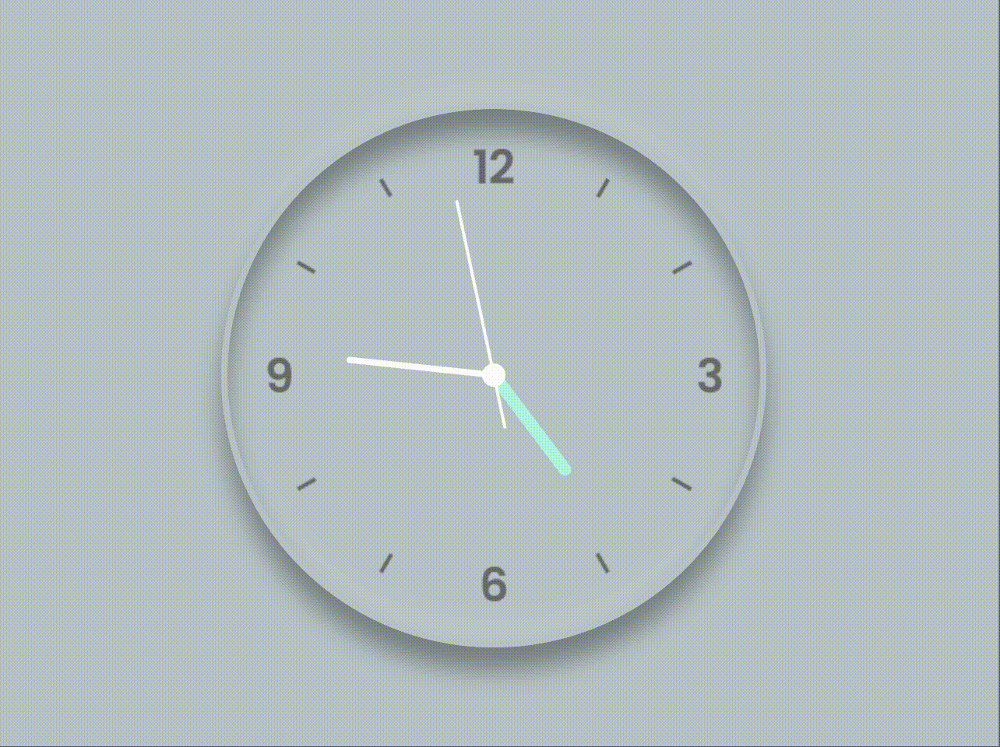

# some-stuffs

The purpose of this repository is to share snippets of source code so you don't have to start from scratch...
 
Also share interesting codes found out there! 🤓

## Content

- [Analog Clock](/analog-clock/) - HTML, CSS, Javascript
   
  (Credits: [coding_dev\_](https://www.instagram.com/coding_dev_/)\)

  

 

- [Image Zoom Effect](/zoom-image-on-hover/) - HTML, CSS
   

- [Flexbox and Range Slider](/flexbox-and-range-slider/) - HTML, CSS, Javascript
   

## Helpful Links

- [Favicon Generator](https://favicon.io/favicon-generator/)
- [Markdown Guide](https://www.markdownguide.org/cheat-sheet/)
